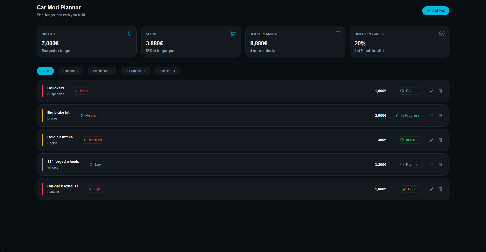
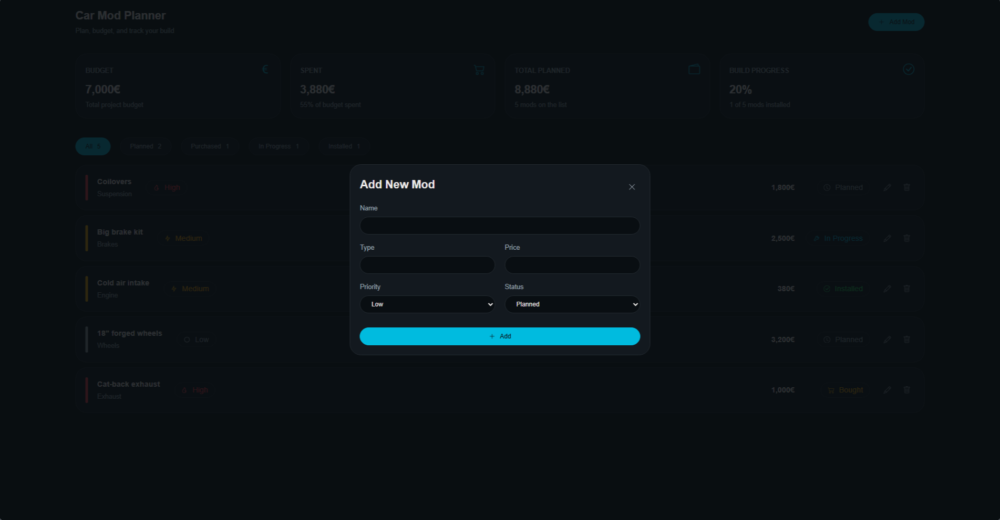
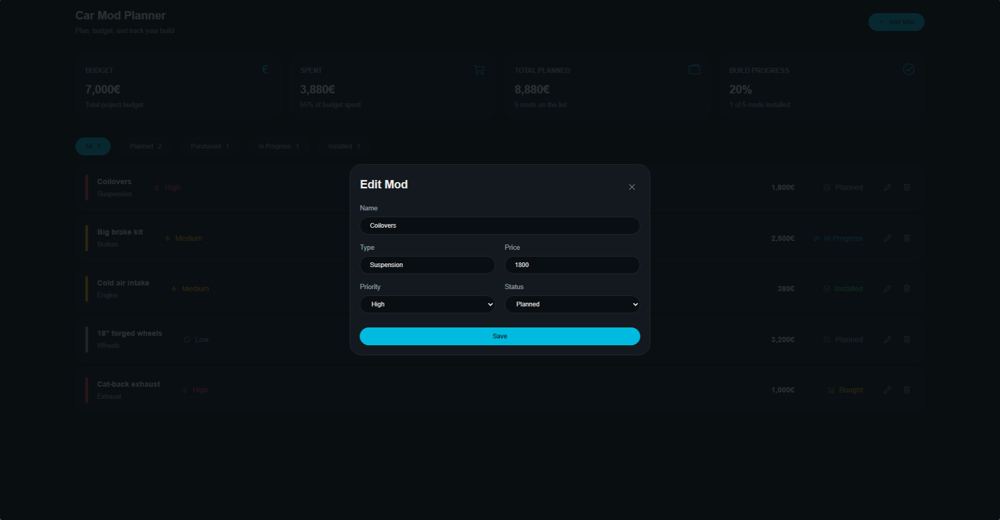
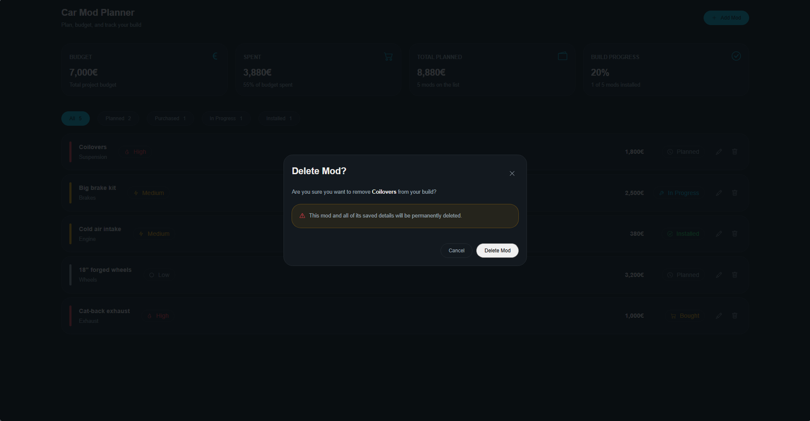

# 🚗 Car Mod Planner

A simple build planning and budgeting app for car enthusiasts.

Project cars are rarely a simple "buy a part, install a part" situation. There are plenty of mods to plan, prioritize, purchase and eventually install. **Car Mod Planner** was built to make that process easier by keeping everything in one place.

Track your mods, monitor their status, keep an eye on your budget and see how far along your build is.

## 🌐 Tech Stack

* Frontend: React + Vite
* Styling: Plain CSS
* Backend/Database: Supabase
* Icons: React Icons

## ✨ Features

### Mod Management

* Add new mods to your build

  * Name
  * Type
  * Price
  * Priority
  * Status
* Edit existing mods
* Delete mods
* View all mods in one centralized list

### Mod Status

Track the progress of each modification through different stages:

* Planned
* Purchased
* In Progress
* Installed

Filter the mod list by status to quickly see what still needs to be done.

### Build Budget & Statistics

* **Budget**

  * Set and edit the total budget for the build
* **Spent**

  * Automatically calculates the total cost of purchased, in-progress and installed mods
  * Shows the percentage of the budget currently spent
* **Total Planned**

  * Calculates the total cost of all mods on the list
  * Shows the total number of mods
* **Build Progress**

  * Calculates the percentage of mods that have been installed
  * Shows the number of installed mods compared to the total number of mods

### User Feedback

* Success and error toast notifications
* Feedback when mods are added, edited or deleted
* Budget save notifications
* Confirmation popup before deleting a mod

## 📸 Application Preview

### Main Dashboard

### Add Mod

### Edit Mod

### Delete Confirmation

## 📄 Pages Overview

### Main Page

The application currently consists of a single-page dashboard containing:

* Build statistics
* Budget information
* Mod filters
* Mod list
* Add, edit and delete functionality

## 🔍 Mod Details

Each mod stores the following information:

* Name
* Type
* Price
* Priority
* Status
* Creation date

Mods can be edited at any time and their status can be updated as the build progresses.

## 💾 Database

The application uses **Supabase** as its backend and database.

### `mod`

Stores all modifications belonging to the build.

* `id`
* `name`
* `type`
* `price`
* `priority`
* `status`
* `created_at`

### `project`

Stores information about the current build.

* `id`
* `budget`
* `created_at`

The application currently supports **one project/build**.

## 🧩 Project Structure

The application is organized into reusable React components and sections.

* `components/`

  * Reusable UI components such as mod cards, buttons, popups and toast notifications
* `sections/`

  * Main dashboard sections such as the header, statistics and mod list
* `supabaseClient`

  * Supabase database connection
* CSS files

  * Component and section-specific styling

## 📌 Future Improvements

* Authentication / login system
* Support for multiple car projects
* Search mods
* Custom sorting options
* Add a link to the website where a part was purchased
* Add notes or descriptions to mods
* More detailed mod information and organization
* Mobile optimization
* Import and export build data

## 🎯 Project Goal

Car Mod Planner is intentionally kept simple for now. The goal is to provide a clean and straightforward way for car enthusiasts to plan their builds without turning the app into an unnecessarily complicated project management system.

As the project grows, additional features can be introduced while keeping the core experience focused on **planning, budgeting and tracking a car build**.
